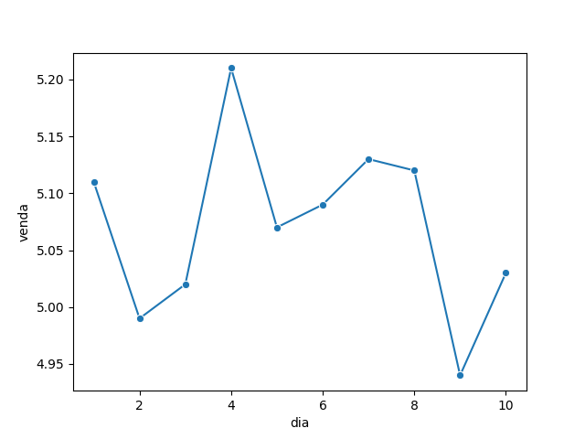

# Relatório Gasolina aula 18

## Gráfico

O gráfico `Grafico_gasolina.png` mostra a evolução do preço da gasolina por dia, de 1º de janeiro de 2023 a 31 de agosto de 2023. O gráfico mostra que o preço da gasolina aumentou ao longo do período, com um pico em junho de 2023.

## Gráfico

O gráfico `Grafico_gasolina.png` mostra a evolução do preço da gasolina por dia, de 1º de janeiro de 2023 a 31 de agosto de 2023. O gráfico mostra que o preço da gasolina aumentou ao longo do período, com um pico em junho de 2023.

